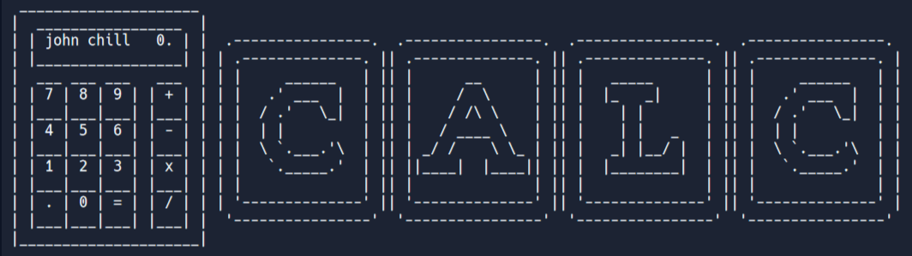

# Simple Python Calculator

  

This Python script implements a basic calculator with operations such as addition, subtraction, multiplication, and division. The user is prompted to enter numbers and choose an operation, and the calculator displays the result. It allows users to perform multiple calculations and continue based on their choice.

## How to Use

1. Run the script in your Python environment.
2. Enter the first number when prompted.
3. Choose an operation from the available options.
4. Enter the second number.
5. View the result and decide whether to continue with the result or exit.

To exit the calculator, enter 'n' when prompted.

Feel free to customize and enhance the calculator script to meet your specific needs.

